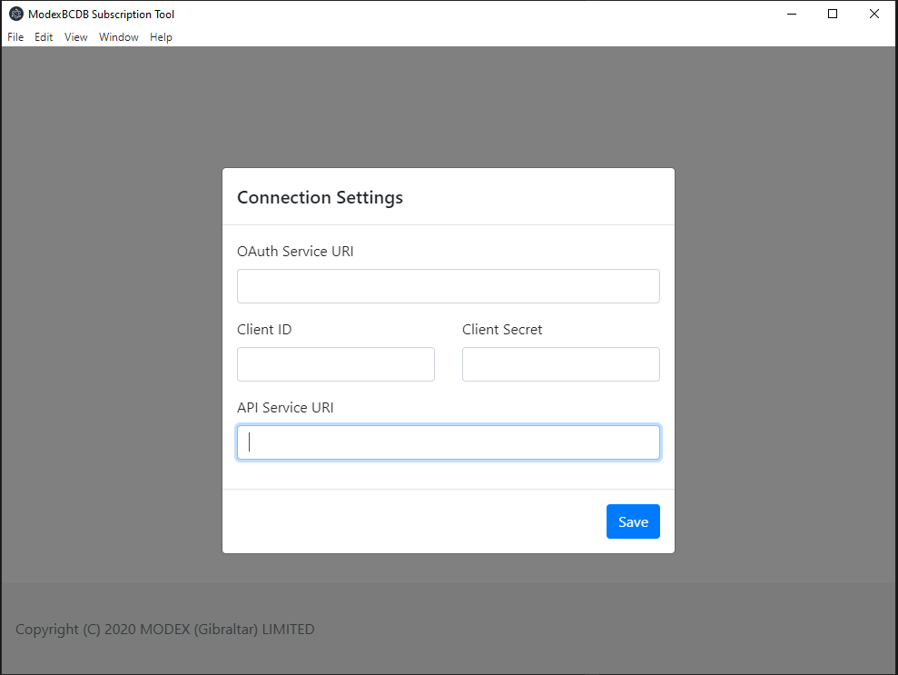
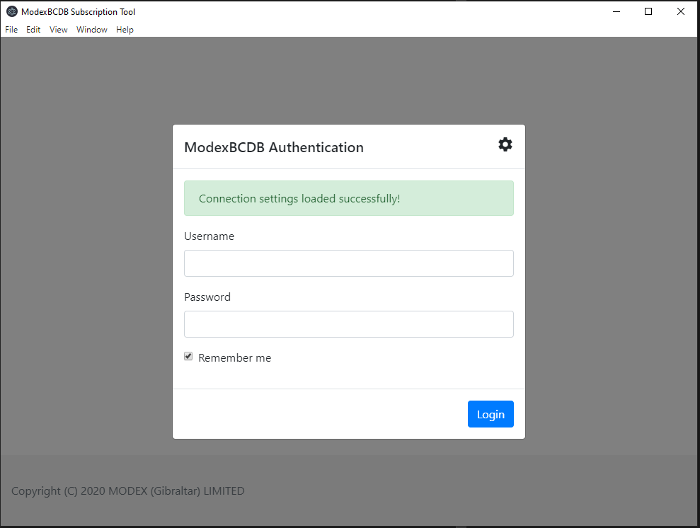

# BCDB Subscription Tool

## Install

1. Windows
    -   Download Windows installer, save it to your prefered location and install
    -   Execute the application

3. MacOS
    -   Download MacOS package
    -   Add bcdb-subscription-tool.app to your Application folder
    -   Open the application

## Usage:

    -   Open the application and press settings:
        

    -   Setup the BCDB connection:     
        -   OAuth Service URI
        -   Client ID
        -   Client Secret
        -   API Service URI

        

    -   Add User name and Password and connect to your BCDB infrastructure
    
        

